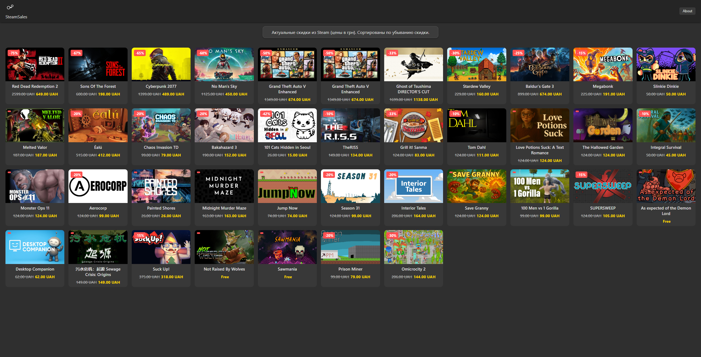

# 🎮 SteamSales — актуальные скидки и новинки из Steam

**SteamSales** — это веб-приложение на Python (Flask), которое отображает **актуальные скидки из Steam** и **новые релизы** в удобном плиточном интерфейсе в стиле Windows 11.  
Приложение автоматически подтягивает данные с официального API Steam и показывает их в виде красивой таблицы с ценами и изображениями.

---

## ✨ Возможности
- 🔥 Отображение **актуальных скидок** (Specials) с сортировкой по размеру скидки.  
- 🆕 Секция **новых релизов** (New Releases) после скидочных игр.  
- 💰 Поддержка отображения цен в выбранной валюте (по умолчанию — гривна, UAH).  
- 🎨 Современный интерфейс: плитки, графитовый фон, плавные анимации.  
- 📌 Информация о каждой игре:
  - Название  
  - Картинка (обложка)  
  - Старая цена (зачёркнута)  
  - Цена со скидкой (выделена)  
  - Процент скидки  
- 🔗 При клике на игру открывается её страница в Steam.  
- 🖼 Модальное окно **About** в шапке.  

---

## 🖼 Скриншот интерфейса
> *(сюда можно вставить реальный скриншот после запуска проекта)*  



---

## 🚀 Установка и запуск

### 1. Клонируйте репозиторий
```bash
git clone https://github.com/yourname/steamsales.git
cd steamsales
```

### 2. Создайте виртуальное окружение и активируйте его
```bash
python -m venv .venv
source .venv/bin/activate   # для Linux/macOS
.venv\Scripts\activate      # для Windows
```

### 3. Установите зависимости
```bash
pip install -r requirements.txt
```

### 4. Запустите сервер
```bash
python app.py
```

После запуска сайт будет доступен по адресу:  
👉 http://localhost:5755

---

## ⚙️ Технологии
- **Backend**: Python, Flask  
- **Frontend**: HTML, CSS (графитовый стиль в духе Windows 11)  
- **API**: [Steam Featured Categories API](https://store.steampowered.com/api/featuredcategories)  
- **Прочее**: Кэширование запросов, автообновление списка скидок и новинок  

---

## 📌 TODO / Идеи для будущих улучшений
- 🔍 Поиск по играм  
- 🏷️ Фильтры по размеру скидки и жанрам  
- 🌍 Переключение валют  
- 📱 Адаптивная мобильная версия  

---

## 📝 Лицензия
MIT License © 2025  
Свободно для использования и модификации.  
